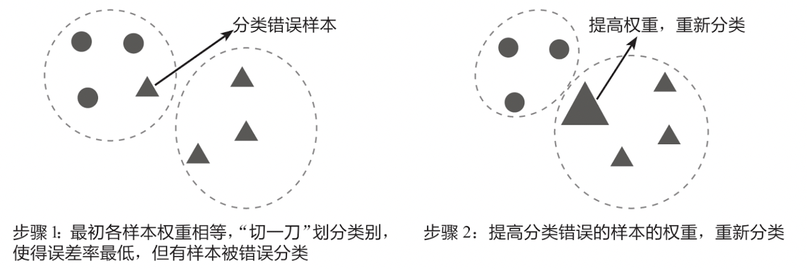
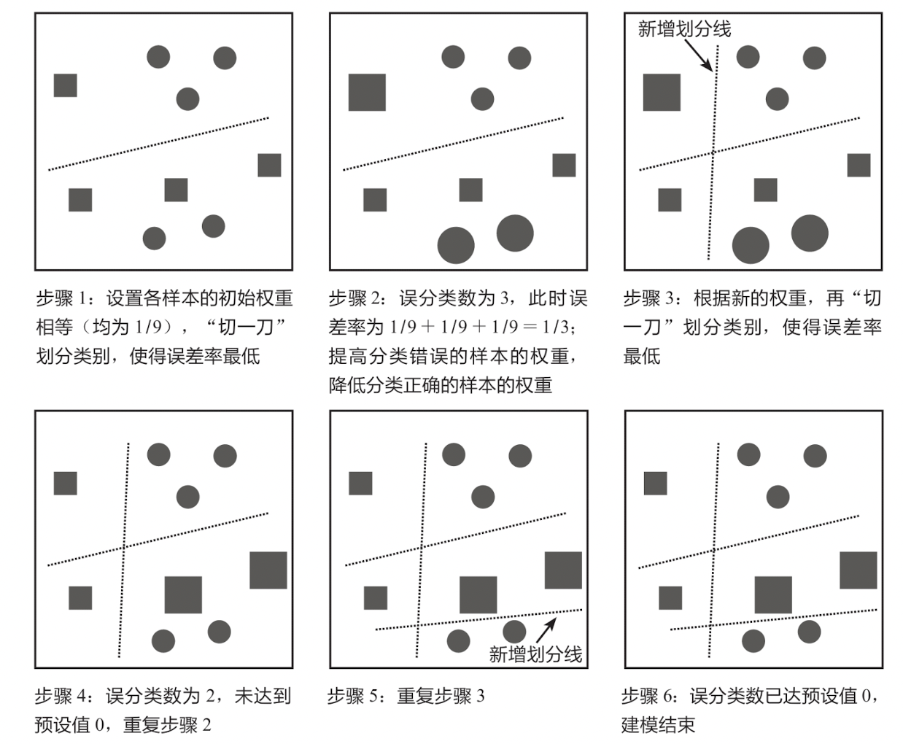
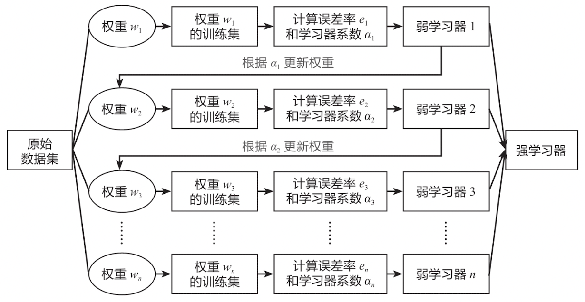

## AdaBoost算法的核心思想

AdaBoost算法(Adaptive Boosting)是一种有效而实用的Boosting算法，它**以一种高度自适应的方式按顺序训练弱学习器**。针对分类问题， AdaBoost算法根据前一次的分类效果调整数据的权重，在上一个弱学习器中分类错误的样本的权重会在下一个弱学习器中增加，分类正确的样本的权重则相应减少，并且在每一轮迭代时会向模型加入一个新的弱学习器。不断重复调整权重和训练弱学习器，直到错误分类数低于预设值或选代次数达到指定最大值，最终得到一个强学习器。简单来说，AdaBoost算法的核心思想就是**调整错误样本的权重，进而选代升级**。

可以借助下图来理解调整权重的概念：在步骤1中先对数据进行分类，此时将小三角形错误地划分到了圆形类别中；在步骤2中调整分类错误的小三角形的权重，使它变成一个大三角形，这样它和三角形类型的数据就更加接近了，在重新分类时，它就能被准确地划分到三角形类别中。

上图反映的是AdaBoost算法的核心思想。如下图所示为更复杂的AdaBoost算法示例，其核心思想和上图一致，这里仅简单演示其运作过程。预先设置AdaBoost算法在误分类数为0(即误差率为0)时终止选代，误差率等于分类错误的样本的权重之和，例如，对于9个样本，每个样本的权重为1/9，若有2个样本分类错误，那么此时的误差率为1/9+1/9=2/9。

## AdaBoost算法的数学原理
了解AdaBoost算法的核心思想后，下面结合具体的分类问题，讲解AdaBoost算法的数学原理。这部分内容较为复杂，如果感觉理解起来有困难，可以跳过，直接学习后面的实战案例。

AdaBoost分类算法的流程图如下图所示：

输入训练数据集， $T=\{(x_1,y_1), (x_2,y_2),...,(x_n,y_n)\}$ ，x为特征变量，有为目标变量，其中 $x_i\in{R^n}$ ， $y_i\in\{-1, 1\}$ 。

下面是具体的算法过程：

**Step 1：** 初始化各样本的权重（样本权重相等）

$$w_{1i}=\frac{1}{N}$$

**Step 2：** 计算误差率

根据误差率 $e_m$ 的计算公式，构造误差率最小的弱学习器 $F_m(x)$ 。

$$e_m = \sum^{N}_{i=1}w_{mi}I(F_m(x_i)\ne{y_i})$$

误差率 $e_m$ 是分类错误的样本的权重之和。其中w是样本i的权重； $F_m (x_i)$ 是弱学习器 $F_m (x)$ 所预测的样本i的分类，即预测值。 $y_i$ 是样本i的实际值； $I(F_m(x_i) \ne y_i)$ 是一个指示函数(Indicator Function)，当括号内的条件成立(即预测失败)时，函数取值为1，否则(即预测成功)取值为0。例如，有5个样本，每个样本的权重为1/5，若前3个样本分类错误，那么此时的误差率为1/5x 1+1/5x1+1/5x1+1/5x0+1/5x0=3/5。

**Step 3：** 调整弱学习器的权重

有了误差率之后，就可以调整原来的弱学习器的权重了。弱学习器 $F_m (x)$ 的系数 $a_m$ 的计算公式如下：

$$a_m = \frac{1}{2}ln\frac{1-e_m}{e_m}$$

得到第m次迭代的强学习器，公式如下：

$$f_m(x) = \sum^m_{i=1}a_mF_i(x)$$

**Step 4：** 更新样本的权重

有了弱学习器的权重后，就可以更新原来样本的权重。这也是AdaBoost算法的核心所在：**增大分类错误的样本的权重，减小分类正确的样本的权重，从而实现更为准确的分类。**

样本权重的更新公式如下：

$$w_{m+1,i} = \frac{w_mi}{Z_m}exp(-a_my_iF_m(x_i)) \quad\quad (i=1,2,...,N)$$

其中：

$$\sum^N_{i=1}w_{m+1,i}=1$$

$w_{m+1,i}$ 是本次更新的样本权重， $w_{mi}$ 是上次的样本权重，各样本权重之和是1。 $a_m$ 是第m次迭代中弱学习器 $F_m(x)$ 的系数， $y_i$ 是样本i的实际值， $F_m(x_i)$ 是弱学习器 $F_m(x)$ 所预测的样本i的分类， $Z_m$ 是一个规范化因子，其公式如下：

$$Z_m = \sum^N_{i=1}w_{mi}exp(-a_my_iF_m(x_i))$$

这里的 $exp(x)$ 为指数函数 $e^x$ 的另一种写法。

**Step 5：** 反复迭代

将上面的过程反复选代，直到误分类数达到阅值或选代次数达到设定的最大值。M次选代后得到最终强学习器如下：

$$sign[f_M(x)]=sign\left[\sum^M_{i=1}a_iF_i(x)\right]$$

其中 $sign(x)$ 是符号函数，即：

$$
sign(x) = \begin{cases}
\quad 1,\quad x > 0 \\
\quad 0,\quad x = 0 \\
\ -1, \quad x< 0
\end{cases}
$$

至此，AdaBoost算法的数学原理介绍完毕。

### 补充知识：正则化项

为防止AdaBoost算法过拟合，可以向模型加入正则化项。即，每个弱学习器的权重缩减系数 $\upsilon$ ，又称为learning rage（学习率）。

弱学习器的迭代公式：

$$f_m(x) = \sum^m_{i=1}a_mF_i(x)$$

加入权重缩减系数后公式变为：

$$f_m(x) = \sum^m_{i=1}{\upsilon}a_mF_i(x)$$

权重缩减系数 $\upsilon$ 的取值范围为(0， 1]。取值较小意味着要达到一定的误分类数或学习效果，需要的选代次数更多，需要训练的弱学习器更多；取值较大意味着要获得相同的学习效果，需要的选代次数更少，需要训练的弱学习器更少。

## AdaBoost算法的数学原理举例

*待补充*

