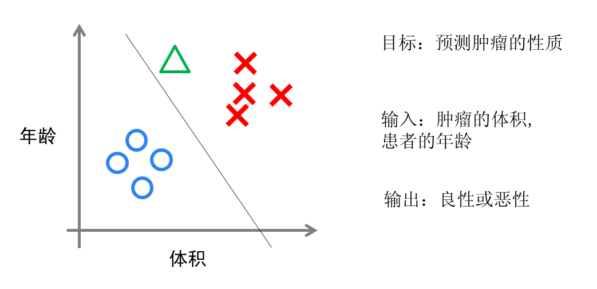

## 什么是机器学习
机器学习是把人类思考归纳的过程转化为计算机通过对数据的处理计算得出模型的过程。经过计算机得出的模型能够以近似于人的方式解决很多复杂的问题。

从广义上来说，机器学习通过赋予机器学习的能力，让其完成直接编程无法完成的功能。但从实践的意义上来说，机器学习是一种通过利用数据，训练模型，然后使用模型进行预测的一种方法。

人类在成长、生活过程中积累了很多历史经验（数据），然后对这些经验进行“归纳”，获得了“规律”（模型）。当遇到未知的问题或者需要对未来进行“推测”时，就会使用这些“规律”，对未知问题进行“推测”（预测），从而指导自己的生活和工作。

机器学习中的“训练”与“预测”过程，可以对应到人类的“归纳”和“推测”过程。通过这样的对应，我们发现机器学习的思想并不复杂，仅仅是对人类学习成长的一个模拟。由于机器学习不是基于编程形成的结果，因此它的处理过程不是因果的逻辑，而是通过归纳思想得出的相关性结论。

我们举个例子，支付宝春节的“集五福”活动，用手机扫“福”字照片自动识别福字。支付宝先给计算机提供大量“福”字的照片数据，通过算法模型训练，系统不断学习，然后输入一张新的福字照片，机器就能自动识别这张照片是否含有福字，这就是用了机器学习。

机器学习是一门多领域交叉学科，涉及概率论、统计学、逼近论、凸分析、算法复杂度理论、计算机科学等多门学科。机器学习的概念就是通过输入海量训练数据对模型进行训练，使模型掌握数据所蕴含的潜在规律，进而对新输入的数据进行准确的分类或预测。其过程如下图所示：

## 机器学习的场景
机器学习跟模式识别、统计学习、数据挖掘、计算机视觉、语音识别、自然语言处理等领域有着很深的联系。

从范围上来说，机器学习跟模式识别、统计学习、数据挖掘相类似。同时，机器学习与其他领域结合，形成了计算机视觉、语音识别、自然语言处理等多种交叉学科。因此，一般说数据挖掘，可以等同于说机器学习。同时，我们常说的机器学习应用的场景，是指通用场景，不局限在结构化数据，还有图像、音频等领域的应用。

下图是与机器学习相关的应用领域：

### 模式识别

**模式识别 = 机器学习**。

两者的主要区别在于前者是从工业界发展起来的概念，后者则源自计算机学科。在著名的《Pattern Recognition And Machine Learning》这本书中，Christopher M. Bishop在开头是这样说的“模式识别源自工业界，而机器学习来自于计算机学科。不过，它们中的活动可以被视为同一个领域的两个方面，同时在过去的10年间，它们都有了长足的发展”。

### 数据挖掘

**数据挖掘 = 机器学习+数据库**。

近些年，数据挖掘的概念实在过于火爆，几乎等同于炒作。但凡说数据挖掘都会吹嘘数据挖掘如何如何，例如从数据中挖出金子，以及将废弃的数据转化为价值等等。但是，尽管可能会挖出金子，但也可能挖到的是“石头”。这个说法的意思是，数据挖掘仅仅是一种思考方式，告诉我们应该尝试从数据中挖掘出知识，但不是每个数据都能挖掘出金子的，所以不要神话它。一个系统绝对不会因为上了一个数据挖掘模块就变得无所不能(这是IBM最喜欢吹嘘的)，恰恰相反，一个拥有数据挖掘思维的人员才是关键，而且他还必须对数据有深刻的认识，这样才可能从数据中导出模式指引业务的改善。大部分数据挖掘中的算法是机器学习的算法在数据库中的优化。

### 统计学习

**统计学习 ≈ 机器学习**。

统计学习是与机器学习高度重叠的学科。因为机器学习中的多数方法来自统计学，甚至可以认为，统计学的发展促进机器学习的繁荣。例如著名的[支持向量机算法][1]，就源自统计学科。但是在某种程度上两者是有分别的，这个分别在于：**统计学习者重点关注的是统计模型的发展与优化，偏数学，而机器学习者更关注的是能够解决问题，偏实践**。因此，机器学习人员会重点研究学习算法在计算机上执行的效率与准确性。

### 自然语言处理

**自然语言处理 = 机器学习+文本处理**。

自然语言处理技术，是让机器理解人类的语言的一门领域。在自然语言处理技术中，大量使用编译原理相关的技术，例如词法分析，语法分析等。除此之外，在理解这个层面，则使用了语义理解、机器学习等技术。作为唯一由人类自身创造的符号，自然语言处理一直是机器学习界不断研究的方向。按照百度机器学习专家余凯的说法“**听与看，说白了就是阿猫和阿狗都会的，而只有语言才是人类独有的**”。如何利用机器学习技术进行自然语言的深度理解，一直是工业和学术界关注的焦点。

### 计算机视觉

**计算机视觉 = 机器学习+图像处理**。

图像处理技术，将图像处理为适合机器学习模型中的输入。机器学习则负责从图像中识别出相关的模式。计算机视觉相关的应用非常的多，例如OCR识图、手写字符识别、车牌识别等等应用。这个领域是应用前景非常火热的，同时也是研究的热门方向。随着机器学习的新领域深度学习的发展，大大促进了计算机图像识别的效果，因此未来计算机视觉界的发展前景不可估量。

### 语音识别

**语音识别 = 机器学习+语音处理**。

语音识别就是音频处理技术与机器学习的结合。语音识别技术一般不会单独使用，一般会结合自然语言处理的相关技术。目前的相关应用有苹果的语音助手siri等。

## 机器学习的经典算法

通过上述介绍，我们知道了机器学习的应用场景，那机器学习有多少种经典算法呢？在这个部分我们简要介绍机器学习中的具有代表性的算法，重点介绍算法的思想，数学原理及实践细节不做讨论。

### （1）回归算法
在机器学习课程中，回归算法都是学习的第一个算法。原因有两个：①、回归算法比较简单，介绍它可以让我们平滑地从统计学迁移到机器学习中；②、回归算法是后面若干强大算法的基石，如果不理解回归算法，则无法学习那些强大的算法。回归算法有两个重要的子类：[线性回归][2]和[逻辑回归][3]。

线性回归是前面说过的房价求解问题。如何拟合出一条直线最佳匹配所有数据？一般使用“最小二乘法”求解。它的思想是这样的，假设我们拟合出的直线代表数据的真实值，而观测到的数据代表拥有误差的值，为了尽可能减小误差的影响，需要求解一条直线使所有误差的平方和最小。最小二乘法将最优问题转化为求函数极值问题。函数极值在数学上一般会采用求导数为0的方法。但这种做法并不适合计算机，因为计算机可能求解不出来，也可能计算量太大。

计算机科学界专门有一个学科叫**数值计算**，专门用来提升计算机计算时的准确度问题和效率问题。例如，著名的**梯度下降**以及**牛顿法**就是数值计算中的经典算法，非常适合来处理求解函数极值问题。梯度下降法是解决回归模型中最简单有效的方法之一。从严格意义上来说，后文中的神经网络和推荐算法中都有线性回归的因子，因此梯度下降法在后面的算法实现中也有应用。

逻辑回归与线性回归类似，但是，从本质上讲，两者处理的问题类型不一致。线性回归处理的是数值问题，最后预测出的结果是数字，例如房价。而逻辑回归属于分类算法，预测结果是离散的分类，例如判断邮件是否是垃圾邮件，以及用户是否会点击此广告等等。

实现方面的话，逻辑回归只是对线性回归的计算结果做了一次Sigmoid变换，将数值结果转化为了0~1之间的概率(Sigmoid函数的图像一般来说并不直观，我们只需要理解对数值越大，函数越逼近1，数值越小，函数越逼近0)。接着根据概率就可以做预测，例如概率大于0.5，则邮件是垃圾邮件，或者肿瘤是否是恶性等等。从直观上来说，逻辑回归是画出了一条分类线，见下图：

假设有一组肿瘤患者数据，有些肿瘤是良性的(图中的蓝色点)，有些是恶性的(图中的红色点)。这里肿瘤的红蓝色可以被称作数据的“标签”。同时每个数据包括两个“特征”：患者的年龄与肿瘤的大小。我们将两个特征与标签映射到二维空间上，形成了上图数据。

当我们有一个绿色点时，该判断肿瘤是恶性还是良性的呢？根据红蓝点我们训练出了一个逻辑回归模型，也就是图中的分类线。这时，根据绿点出现在分类线的左侧，因此判断它的标签是红色，也就是说属于恶性肿瘤。

逻辑回归算法划出的分类线基本都是线性的(也有划出非线性分类线的逻辑回归，不过那样的模型在处理数据量较大的时候效率很低)，这意味着当**两类之间的界线不是线性时，逻辑回归的表达能力就不足**。

下面要介绍的两个算法是机器学习领域最强大且最重要的算法，都可以拟合出非线性的分类线。

### （2）神经网络

神经网络(也称人工神经网络，ANN)算法是80年代机器学习界非常流行的算法，不过在90年代中途衰落。现在，携着“深度学习”之势，神经网络重装归来，重新成为最强大的机器学习算法之一。

神经网络的诞生起源于对大脑工作机理的研究。早期生物界学者们使用神经网络来模拟大脑。机器学习的学者们使用神经网络进行机器学习的实验，发现在视觉与语音的识别上效果都相当好。在BP算法(加速神经网络训练过程的数值算法)诞生以后，神经网络的发展进入了一个热潮。BP算法的发明人之一是机器学习大牛Geoffrey Hinton。

神经网络的学习原理是什么？

简单说，就是分解与整合。在著名的Hubel-Wiesel试验中，学者们研究猫的视觉分析机理是这样的。

比方说，一个正方形，分解为四个折线进入视觉处理的下一层中。四个神经元分别处理一个折线。每个折线再继续被分解为两条直线，每条直线再被分解为黑白两个面。于是，一个复杂的图像变成了大量的细节进入神经元，神经元处理以后再进行整合，最后得出了看到正方形的结论。这就是大脑视觉识别的机理，也是神经网络工作的机理。

让我们看一个简单的神经网络的逻辑架构。在这个网络中，分成输入层，隐藏层，和输出层。输入层负责接收信号，隐藏层负责对数据的分解与处理，最后的结果被整合到输出层。每层中的一个圆代表一个处理单元，可以认为是模拟了一个神经元，若干个处理单元组成了一个层，若干个层再组成了一个网络，也就是"神经网络"。

在神经网络中，每个处理单元事实上就是一个逻辑回归模型，逻辑回归模型接收上层的输入，把模型的预测结果作为输出传输到下一个层次。通过这样的过程，神经网络可以完成非常复杂的非线性分类。

下图演示了神经网络在图像识别领域的一个著名应用，这个程序叫做LeNet，是一个基于多个隐层构建的神经网络。通过LeNet可以识别多种手写数字，能达到很高的识别精度并拥有较好的**鲁棒性**。

右下方的方形中显示的是输入计算机的图像，方形上方的红色字样“answer”后面显示的是计算机的输出。左边的三条竖直的图像列显示的是神经网络中三个隐藏层的输出，可以看出，随着层次的不断深入，越深的层次处理的细节越低，例如层3基本处理的都已经是线的细节了。LeNet的发明人是机器学习领域的大牛Yann LeCun。

进入90年代，神经网络的发展进入了一个瓶颈期。其主要原因是尽管有BP算法的加速，神经网络的训练过程仍然很困难。因此90年代后期支持向量机(SVM)算法取代了神经网络的地位。

### （3）SVM（支持向量机）

### （4）聚类算法

### （5）降维算法

### （6）推荐算法

### （7）其他

### 

## 机器学习与大数据
## 机器学习与深度学习
## 机器学习与人工智能
## 总结

> 原文地址：[计算机的潜意识](https://www.cnblogs.com/subconscious/p/4107357.html)@博客园

  [1]: https://github.com/likuli/data-analysis-learning/blob/main/docs/analysis_ai/svm.md
  [2]: https://github.com/likuli/data-analysis-learning/blob/main/docs/analysis_ai/linear_regression.md
  [3]: https://github.com/likuli/data-analysis-learning/blob/main/docs/analysis_ai/logistic_regression.md