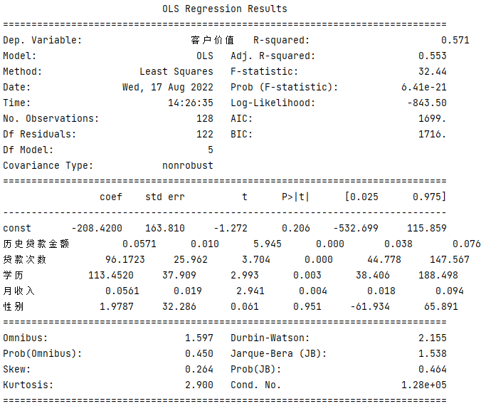

利用多元线性回归模型可以根据多个因素来预测客户价值，当模型搭建完成后，便可对不同价值的客户采用不同的业务策略。

这里以信用卡客户的客户价值为例来解释客户价值预测的具体含义：客户价值预测就是指预测客户在未来一段时间内能带来多少利润，其利润可能来自信用卡的年费、取现手续费、分期手续费、境外交易手续费等。分析出客户价值后，在进行营销、电话接听、催收、产品咨询等各项业务时，就可以针对高价值客户提供区别于普通客户的服务，以进一步挖掘高价值客户的价值，并提高客户的忠诚度。

#### step 1：读取数据
通过如下代码读取相关数据：

```python
df = pd.read_excel('../../../data/ai/客户价值数据表.xlsx')
df.head()  # 显示前5行数据

X = df[['历史贷款金额', '贷款次数', '学历', '月收入', '性别']]
Y = df['客户价值']
print(df.head())
```

#### step 2：搭建模型
通过如下代码搭建线性回归模型：

```python
model = LinearRegression()
model.fit(X, Y)
```

#### step 3：构造回归方程

通过如下代码查看线性回归方程的系数和常数项：

```python
print('各系数为:' + str(model.coef_))
print('常数项系数k0为:' + str(model.intercept_))
```
输出结果如下：

```python
各系数为:[5.71421731e-02 9.61723492e+01 1.13452022e+02 5.61326459e-02 1.97874093e+00]
常数项系数k0为:-208.42004079958383
```

这里通过regr.coef_获得的是一个系数列表，分别对应不同特征变量前面的系数，即k1、k2、k3、k4、k5，所以此时的多元线性回归方程如下：

$y = -208 + 0.057x_1 + 96x_2 + 113x_3 + 0.056x_4 + 1.98x_5 $

#### step 4：评估模型

评估搭建的多元线性回归模型，代码如下:

```python
X2 = sm.add_constant(X)
est = sm.OLS(Y, X2).fit()
print(est.summary())
```

运行结果如下图：



可以看到，模型的R-squared值为0.571，Adj.R-squared值为0.553，整体拟合效果不是特别好，可能是因为本案例的数据量偏少，不过在此数据量条件下也算可以接受的结果。再来观察P值，可以发现大部分特征变量的P值都较小，的确与目标变量（即“客户价值”）显著相关，而“性别”这一特征变量的P值达到了0.951，即与目标变量没有显著相关性，这个结论也符合经验认知，因此，在之后的建模中可以舍去“性别”这一特征变量。

本案例是在已知客户价值的前提下进行建模，如果在不知道客户价值（即不知道目标变量）的前提下进行建模，则属于非监督式机器学习的范畴，此时不能直接预测客户价值，不过可以利用数据聚类对客户进行分群，后面我们会具体讲解。

完整源码：[点这里](https://github.com/likuli/data-analysis-learning/blob/main/code/ai/example/linear-regression-1.py)。