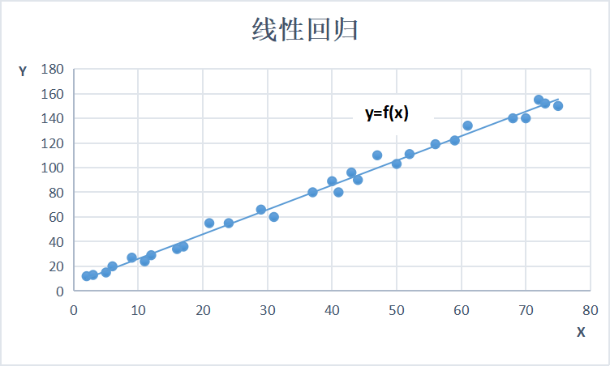
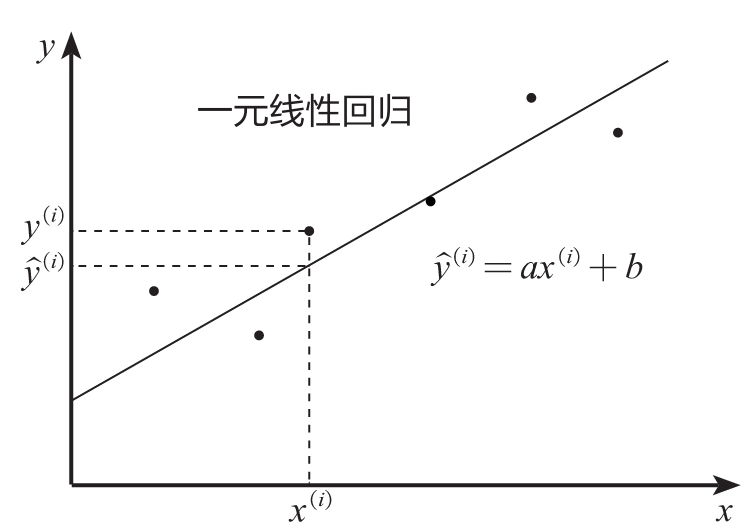
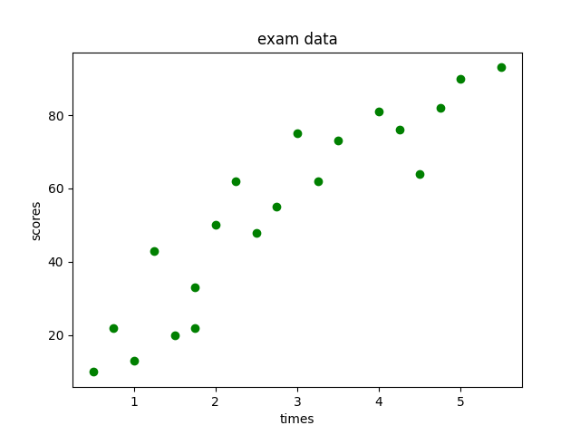
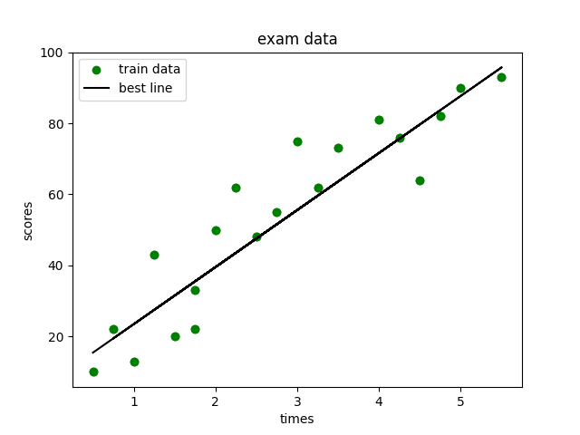

## 什么是线性回归模型？

线性回归模型，是利用线性拟合的方式探寻数据背后的规律。如下图所示，先通过搭建线性回归模型寻找这些散点（也称样本点）背后的趋势线（也称回归曲线），再利用回归曲线进行一些简单的预测分析或因果关系分析。



在线性回归中，根据特征变量（也称自变量）来预测反应变量（也称因变量）。根据特征变量的个数可将线性回归模型分为一元线性回归和多元线性回归。例如，通过“工龄”这一个特征变量来预测“薪水”，就属于一元线性回归；而通过“工龄”+“行业”+“所在城市”等多个特征变量来预测“薪水”，就属于多元线性回归。

## 一元线性回归

### 数学原理

一元线性回归模型又称为简单线性回归模型，其形式可以表示为如下所示的公式：y＝ax＋b

其中，y为因变量，x为自变量，a为回归系数，b为截距。

如下图所示，${y}^{(i)}$为实际值，$\hat{y}^{(i)}$为预测值，一元线性回归的目的就是拟合出一条线来使得预测值和实际值尽可能接近，如果大部分点都落在拟合出来的线上，则该线性回归模型拟合得较好。



那如何衡量实际值与预测值的接近程度呢？在数学上通过两者差值的平方和（又称残差平方和）来进行衡量，公式如下：

$\sum({y}^{(i)}-\hat{y}^{（i）})^{2}$

在机器学习领域，残差平方和又称**回归模型的损失函数**。

显然残差平方和越小，实际值和预测值就越接近。而数学上求最小值的方法为求导数，当导数为0时，残差平方和最小。我们将残差平方和换一个表达形式，公式如下：

$\sum({y}^{(i)}-（a{x}^i+b）)^{2}$

对上述公式进行求导，然后令其导数为0，便可求得一元线性回归模型的回归系数a和截距b。以上便是一元线性回归的数学原理，数学上称为**最小二乘法**。在Python中，有专门的库来求解回归系数a和截距b，不需要我们去计算复杂的数学公式。

### 知识点：最小二乘法

以如下数据为例演示最小二乘法，供大家参考：

$$
\begin{cases}
x = [1, 2, 3] \\
y = [3, 4, 5] 
\end{cases}
$$

假设线性回归模型的拟合方程为y＝ax＋b，那么残差平方和（损失函数）可以定义成如下所示的公式:

$$L = \sum_{i=1}^m(y^i-(ax^i+b))^2$$

拟合的目的是使残差平方和尽可能地小，即实际值和预测值尽可能地接近。根据高等数学中求极值的相关知识，通过对残差平方和进行求导（对a和b进行求导），导数为0时，该残差平方和将取极值，此时便能获得拟合需要的系数a和截距b了。

根据高等数学中复合求导的知识可知f'（g（x））=f'（x）g'（x），又因为x2的导数为2x，所以（g（x））2的导数为2g（x）g'（x），分别对a和b求导，得到如下公式。

$$
\begin{cases}
①对a求导 \\
\sum_{i=1}^m2(y^i-(ax^i+b))^2x^i = 0 \\
②对b求导 \\
\sum_{i=1}^m2(y^i-(ax^i+b))^2 = 0
\end{cases}
$$

将x和y的值代入且等号两边同除以2，得到：

$$
\begin{cases}
(3-(a+b))×1 + (4-(2a+b))×2 + (5-(3a+b))×3 = 0 \\
(3-(a+b)) + (4-(2a+b)) + (5-(3a+b)) = 0
\end{cases}
$$

简化如下：

$$
\begin{cases}
26-14a-6b = 0 \\
12-6a-3b = 0
\end{cases}
$$

求解：

$$
\begin{cases}
a = 1 \\
b = 2
\end{cases}
$$
也就是说拟合曲线为y＝x＋2，可以发现完美拟合了3个点，感兴趣的读者可以验证一下，此时的残差平方和的确取最小值，且为0。对于多元线性回归，其各个系数和截距的推导方法和上面是一致的，只不过变成了多元方程组而已。

> 看不懂也没关系，使用Python可直接进行求解。

### 代码实现一元线性回归
通过Python的Scikit-Learn库可以轻松搭建一元线性回归模型。

下面通过构造学生的学习时间和考试成绩的数据，来讲解如何在Python中搭建一元线性回归模型。

**step1：构造数据**

```python
from collections import OrderedDict
import pandas as pd

examDict = {
    '学习时间': [0.50, 0.75, 1.00, 1.25, 1.50, 1.75, 1.75, 2.00, 2.25,
             2.50, 2.75, 3.00, 3.25, 3.50, 4.00, 4.25, 4.50, 4.75, 5.00, 5.50],
    '分数': [10, 22, 13, 43, 20, 22, 33, 50, 62,
           48, 55, 75, 62, 73, 81, 76, 64, 82, 90, 93]
}
examOrderDict = OrderedDict(examDict)
exam = pd.DataFrame(examOrderDict)

# 查看数据格式
print(exam.head())

# 输出：
#   学习时间  分数
# 0  0.50  10
# 1  0.75  22
# 2  1.00  13
# 3  1.25  43
# 4  1.50  20
```

**step2：绘制散点图**

利用Matplotlib库绘制散点图，代码如下：
```python
import matplotlib.pyplot as plt

exam_X = exam['学习时间']
exam_Y = exam['分数']

plt.scatter(exam_X, exam_Y, color = 'green')
plt.ylabel('scores')
plt.xlabel('times')
plt.title('exam data')
plt.show()
```
结果如下：



**step3：划分数据集**

将样本数据随机划分为训练集和测试集，代码如下：
```python
from sklearn.model_selection import train_test_split
X_train, X_test, Y_train, Y_test = train_test_split(exam_X,
                                                    exam_Y,
                                                    train_size = 0.8)
# 查看分割后的结果
print(X_train.head())
print(X_train.shape)
```

**step4：搭建模型**

引入Scikit-Learn库可快速搭建线性回归模型，代码如下：
```python
X_train = X_train.values.reshape(-1, 1)
X_test = X_test.values.reshape(-1, 1)
#从skl中导入线性回归的模型
from sklearn.linear_model import LinearRegression
#创建模型
model = LinearRegression()
#训练模型
model.fit(X_train, Y_train)
```
用fit()函数完成模型搭建，此时的model就是一个搭建好的线性回归模型。

**step5：模型预测**

接着就可以利用搭建好的模型model来预测数据。假设自变量是1.5，那么使用predict()函数就能预测对应的因变量y，代码如下：
```python
print(model.predict([[1.5]]))
```
输出：[31.90969141]

**step6：模型可视化**

将搭建好的模型以可视化的形式展示出来，代码如下:
```python
import matplotlib.pyplot as plt
#绘制散点图
plt.scatter(exam_X, exam_Y, color = 'green', label = 'train data')
#设定X,Y轴标签和title
plt.ylabel('scores')
plt.xlabel('times')

#绘制最佳拟合曲线
Y_train_pred = model.predict(X_train)
plt.plot(X_train, Y_train_pred, color = 'black', label = 'best line')

#来个图例
plt.legend(loc = 2)

plt.show()
```
效果如下：



**step7：构造线性回归方程**

```python
a = model.intercept_
b = model.coef_
a = float(a)
b = float(b)
print('该模型的线性回归方程为y = {} + {} * x'.format(a, b))
```
该模型的线性回归方程为：y = 7.821319018404893 + 16.57464212678937 * x

## 线性回归模型评估

## 多元线性回归

多元线性回归的原理和一元线性回归的原理在本质上是一样的，不过因为多元线性回归可以考虑到多个因素对目标变量的影响，所以在实际应用中使用更为广泛。

$y = k_0+k_1x_1+k_2x_2+k_3x_3...$

其中x1、x2、x3……为不同的特征变量，k1、k2、k3……则为这些特征变量前的系数，k0为常数项。多元线性回归模型的搭建也是通过数学计算来获取合适的系数，使得如下所示的残差平方和最小，其中${y}^{（i）}$为实际值，$\hat{y}^{（i）}$为预测值。

$\sum({y}^{(i)}-\hat{y}^{（i）})^{2}$

数学上依旧通过最小二乘法和梯度下降法来求解系数。具体步骤可参考最小二乘法知识点，这里主要讲解如何通过Python代码来求解系数。其核心代码和一元线性回归其实是一致的，具体如下：

```python
from sklearn.linear_model import LinearRegression
regr = LinearRegression()
regr.fit(X, Y)
```

上述代码和一元线性回归代码的区别在于这里的X包含多个特征变量信息。利用多元线性回归可以构建更加丰富和实用的模型，例如，根据工龄、地域、行业等因素来预测薪水，根据房屋大小、所处位置、是否靠近地铁等因素来预测房价等。具体实战案例可参考*客户价值预测模型*。

