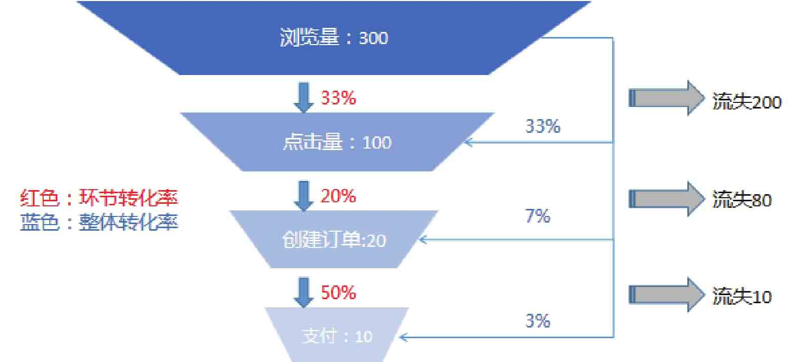
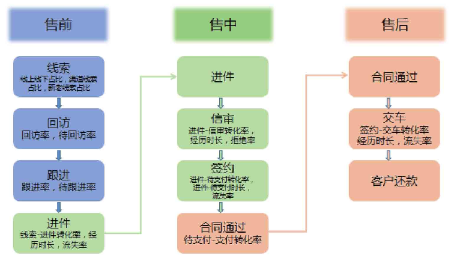
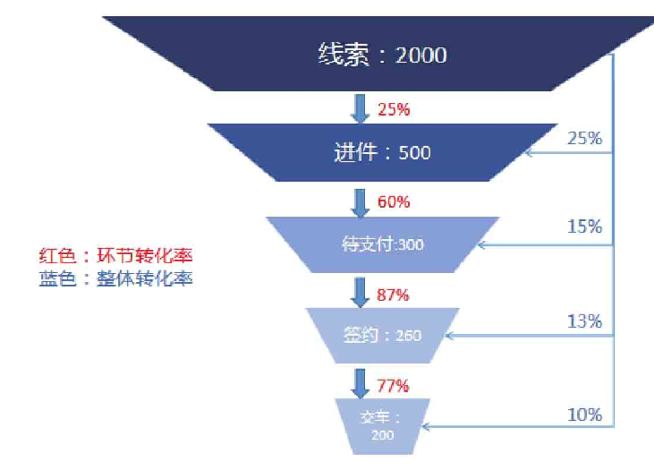
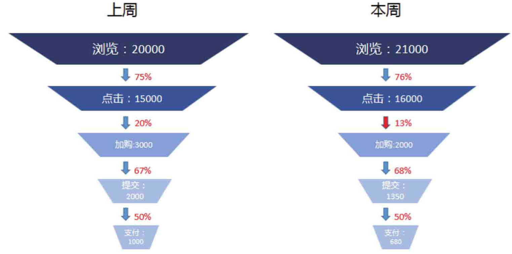

## 什么是漏斗分析法？

从业务流程起点开始到最后目标完成的每个环节都会有用户流失，因此需要一种分析方法来衡量业务流程每一步的转化效率，漏斗分析方法就是这样的分析方法。例如，在淘宝上一款商品的浏览量是300、点击量是100、订单量是20、支付量是10，在业务流程的每一步都有用户流失，如下表：

环节转化率=本环节用户数／上一环节用户数，是为了衡量相邻业务环节的转化情况。例如，表2-24的业务流程中第1环节是浏览，第2环节是点击，那么点击环节的转化率即为100（点击用户数）/300（浏览用户数）=33%。
整体转化率=某环节用户数／第1环节用户数，是为了衡量从第1环节到该环节为止总体的转化情况。例如，表2-24的业务流程中第1环节是浏览，第4环节是支付，那么支付环节的整体转化率为10（支付用户数）/300（浏览用户数）=3%。

把上表做成下图，就是常见的漏斗分析图。因为它的形状像漏斗，所以叫作“漏斗图”。

## 漏斗分析法有什么用？

漏斗分析的作用是“定位问题节点”，即找到出问题的业务环节在哪。漏斗分析常用于用户转化分析或者用户流失分析，所以漏斗分析中要关注两个指标：用户转化率和用户流失率。

经过各个业务环节转化下来的用户，会产生更大的价值。因为这部分用户更加忠诚，更认可业务的流程。随着转化用户的不断增加，留存用户的规模也在不断增大，产品的盈利规模也会随之增加。

流失的用户数量在每个业务环节都不同。可以分析用户主要流失在哪个业务环节，以及为什么流失，是因为业务流程过于复杂，还是产品特性无法完全展现，或是其他原因，最终的目的都是不断减少用户流失率。

## 如何使用漏斗分析法？

以汽车行业为例，可以将业务流程分为三部分：售前、售中、售后，如图所示：

将汽车行业业务流程中的指标与漏斗分析结合，可以得到环节转化率和整体转化率，如图所示：

漏斗分析的整体转化率，是从整体上评估各环节用户占初始环节用户的比例，这样就可以根据一定的比例，去预测未来的大致转化或者流失情况。例如，未来一个月线索达到4000，那么根据目前这个数值（线索-签约转化率为13%），可以大致估算出最后的签约量应该在4000×13%=520左右。

漏斗分析的环节转化率可以评估各业务环节之间的转化情况，通过比较各环节转化率，从而寻找业务瓶颈点，也就是找到最低转化率对应的业务环节。在上面案例中，环节转化率最低的为“线索-进件”（转化率为25%）。为什么“线索-进件”的环节转化率最低呢？

毕竟将单纯的用户（线索）发展到愿意进行信审评估（进件），是件很不容易的事，但是这个点是否就是急需解决和优化的流程呢？这就需要使用对比分析方法和行业平均值来比较。如果行业平均值为19%，那么这里的25%已经超出行业均值6个百分点了，不应作为最急需解决的点，而应着眼后续流程，即寻找后面的转化薄弱点。如果无法得知行业内平均值，可以与本公司历史转化率进行比较，找出表现最差的业务环节，对症下药，持续优化。对于不同的场景，可以灵活运用漏斗分析。

下面再来看一个案例。某线上店铺本周的销量降低严重，从上周的1000单掉到了680单，那么是中间哪个业务环节出了问题？如何改善这种情况？这需要向前探索，去分析用户从浏览商品到最后下单需要经历的步骤是什么，再看这些步骤中，哪一个是薄弱环节，影响了订单的整体转化率。

该案例的业务流程是：浏览商品、点击商品、加购物车、提交订单、支付订单。业务流程确定后，使用对比分析方法将本周和上周的数据进行比较，然后用漏斗分析方法来分析，算出各周的环节转化率，如图所示：

在两周数据的对比分析中，可以发现“点击-加购”的环节转化率明显降低（从20%降为13%），这意味着用户点击商品后，却不愿意将商品加入购物车。

与业务人员沟通后发现，店铺在本周更换了商品的介绍页，用户看到本期的商品介绍后，加购的意愿却降低了，导致最后订单量降低。

找到原因后，就可以针对性地对商品介绍页进行调优和改善，例如与上期的介绍页结构保持一致，色彩优化等，从而提升运营效率和转化率。

## 注意事项

使用漏斗分析方法来分析用户转化问题时，不同行业的业务流程不一样，所以漏斗分析图也不一样。如果把漏斗分析方法原封不动地带入某个行业，不去结合所在行业的业务特点，那么分析出的结果很难具有业务指导性。

例如，传统的漏斗图是以[AARRR模型](https://github.com/likuli/data-analysis-learning/blob/main/docs/analysis_method/10_aarrr_analysis.md)为基础，即获客、留存、活跃、变现、推荐，这是以用户增长为核心的漏斗图。但是对于非社区类产品，例如低频且成交周期长的购车场景而言，传统的AARRR模型无法真正表达出汽车行业的业务需求。将漏斗分析方法和购车的业务流程结合起来，这就形成了线索、进件、过审、签约、交车的漏斗图。所以，漏斗分析方法要结合行业进行调整，才可以产生指导作用。