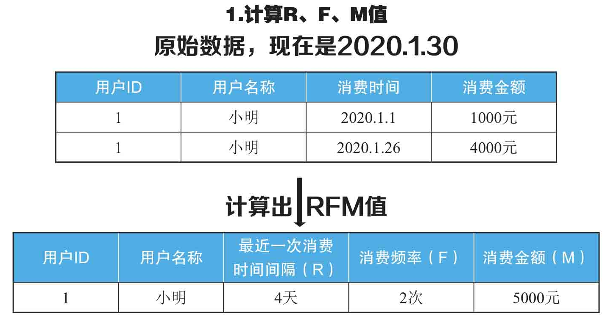
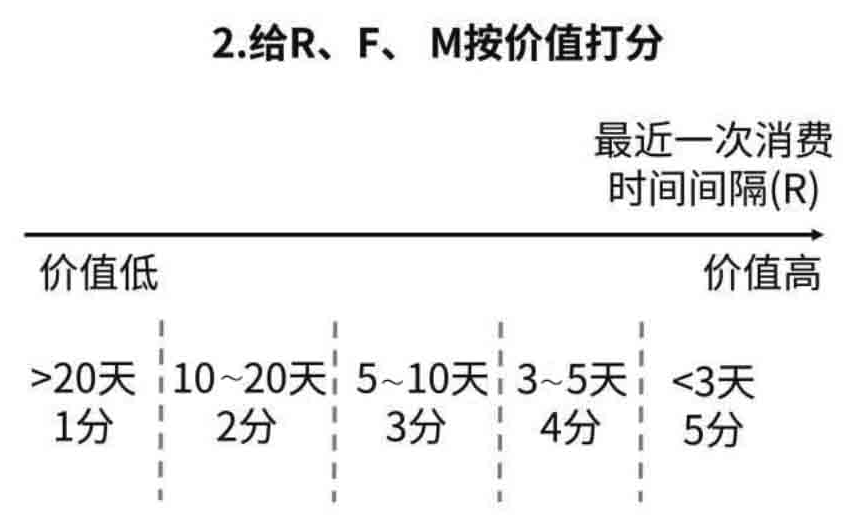

# RFM分析法

## 什么是RFM分析法？

RFM是3个指标的缩写：最近1次消费时间间隔（Recency）、消费频率（Frequency）、消费金额（Monetary），通过这3个指标对用户分类的方法称为RFM分析方法。

举例说明3个指标是什么意思。假如小明是某家店铺的用户，今天是本月30号。

（1）最近1次消费时间间隔（R）是指用户最近一次消费距离现在多长时间了。

小明最近1次在店铺买东西是这个月26号，上一次消费距离现在（这个月30号）过去了4天，所以小明的最近1次消费时间间隔是4天。

（2）消费频率（F）是指用户一段时间内消费了多少次。

如果对“一段时间”的定义是最近30天，发现小明最近30天在店铺消费了2次（小明在1号、26号进行了消费）。

（3）消费金额（M）是指用户一段时间内的消费金额。

如果对“一段时间”的定义是最近30天，发现小明最近30天总共在店铺消费5000元。

这3个指标针对的业务不同，定义也不同，要根据业务来灵活定义。各指标特征如下：

- 最近1次消费时间间隔（R），最近一次消费时间越短，也就是R值越小，用户价值越高。
- 消费频率（F），购买频率越高，也就是F的值越大，用户价值越高。
- 消费金额（M），消费金额越高，也就是M的值越大，用户价值越高。

根据上述特征，RFM针对用户分类的规则如下：

## RFM分析法的作用是什么？

通过RFM分析法可以把用户分为8类，然后对不同用户使用不同的营销策略，从而把有限资源发挥到最大效果，最终实现精细化运作。例如，针对第1类重要价值用户，这类用户最近一次消费时间较近，消费频率也高，消费金额也高，要提供VIP服务。

## 如何使用RFM分析法？

**第1步：**计算R、F、M的值

要得到R、F、M这3个指标，一般需要数据的3个字段：用户ID或者用户名称、消费时间、消费金额。从这3个字段可以计算出R、F、M这3个指标。例如：

**第2步：**给R、F、M值按价值打分

注意这里是按指标的价值打分，不是按指标数值大小打分。对于最近1次消费时间间隔（R），上一次消费离得越近，也就是R的值越小，用户价值越高。

将R、F、M 3个指标分别按价值从小到大分为1～5分。上述案例里，对于最近1次消费时间间隔（R），大于20天的打1分，10～20天的打2分，5～10天的打3分，3～5天的打4分，3天以内打5分。

实际业务中，如何定义打分的范围，要根据具体的业务来灵活掌握，没有统一的标准。

根据打分规则，可以计算出的R、F、M值进行分类，在后3列填上对应的分值。

**第3步：**计算价值平均值

分别计算出R值打分、F值打分、M值打分这3列的平均值。

**第4步：**用户分类。

在表格里增加3列，分别用于记录R、F、M 3个值是高于平均值，还是低于平均值。

如果一行里的R值打分大于平均值，就在R值高低列里记录为“高”，否则记录为“低”。F值、M值同理。

## 注意事项

（1）R、F、M指标在不同业务下定义不同，要根据业务灵活应用。

举个例子，如果你是滴滴打车的一名运营人员，用RFM分析方法对用户进行分类，你会如何定义R、F、M这3个指标呢？

针对这个业务，R可以定义为“上一次打车距离现在多少天”，F可以定义为“过去30天的打车次数”，M可以定义为“过去30天内打车的总金额”。

为什么F不是“历史打车总数”呢？

因为滴滴打车满足的是用户高频的短途出行需求，如果用户连续一个月未使用，即可定义为流失用户，所以“一段时间”可以定义为“最近30天”。如果是滴滴的代驾或者货车业务，是低频的需求，可以把“一段时间”定义为“一年或者1个季度”。

（2）R、F、M按价值如何确定打分规则？

分值一般分为1～5分，也可以根据具体业务灵活调整。每个分值的范围要根据业务来定，就好比你在开车，车速控制在哪个范围，可以根据路况灵活把握。

此外，RFM打分的规则可以与业务部门沟通，进行头脑风暴。或者使用聚类的方法对R、F、M的值进行分类，然后给每个类别打分。

（3）R、F、M这三个指标可以灵活和其他分析方法结合使用。

例如，某个店铺做活动以后，希望对老用户的表现做复盘总结。可以使用对比分析方法来比较该店铺今年和去年同样活动中老用户的复购情况。

可以使用R值来衡量老用户的复购情况。R值定义为老用户最后一次消费时间间隔，这样R值可以反映老用户的活跃程度和复购周期。可以简单理解为R值越小，用户越活跃、复购周期越短。

